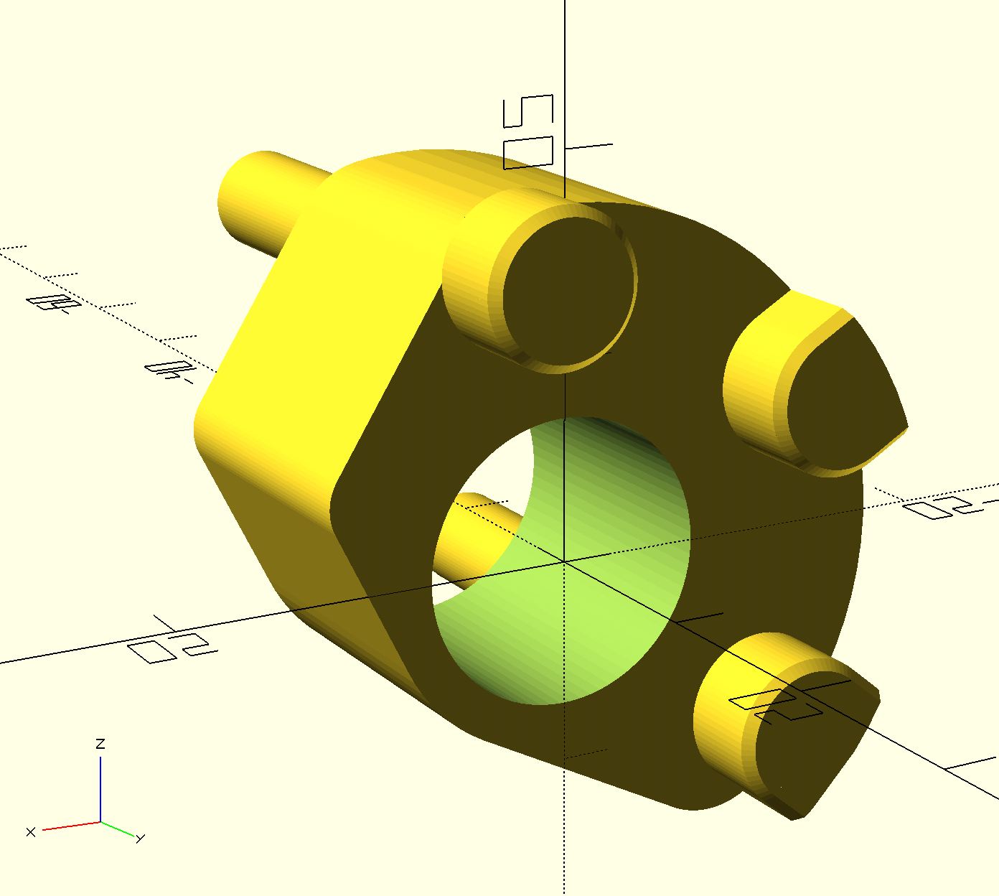

# Overload protection part for BMW C1 stand mechanic

## Design

The design was created from a broken part by measuring and test-printing several parts until tolerances in the most critical dimensions were around 0.1mm.

## Print

The part needs to be very stiff so orientation on the printbed matters. For maximum stiffness i printed the part with a layer height of 0.1mm, 60% infill and 7 solid shells. Including some small support structures the print took around 2 hours on a Pruse MK3S.

I printed the part in PLA. PLA also has excellent properties when it comes to interacting with oil or fuel (does not get soft or breaks). 

## Assembly

For Assmbly of the part on your C1 follow these few steps:

* Put C1 on stand, secure againts falling over
* Unscrew the bowden wire holder on the left side of the stand
* Remove the retaining ring und slide stand lever off the axle
* Remove the broken overload protection
* Carefully slide the new overload protection on, dont bend or put stress on the small metallic switch lever, which is actuated by the overload protection.
* Reassemble retaining ring and bowden wire holder
